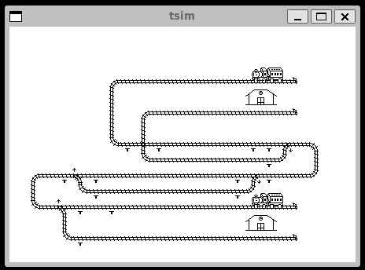

# Documentation

## Sensors & Zones

A Zone consists of two different sensors (in the case of the train stations the zone only have one sensor). When a sensor is activated, the zone toggles it's "active" status.

This gives us the following functionality:
- When a train passes a sensor, the zone for that sensor is now active.
- When the same train passes the second sensor, the zone now becomes inactive.

This way we know if a track-segment is occupied or not.

*The following picture displays our sensor placement:*

### Zones

1. Station North A: (7,7) --- (15,3)
2. Station North B: (16,8) --- (15,5)
3. Station South A: (4,13) --- (15,13)
4. Station South B: (6,11) --- (5,11)
5. Zone 1: (4,11) --- (3,9)
6. Zone 2: (5,9) --- (14,9)
7. Zone 3: (5,10) --- (14,10)
8. Zone 4: (16,9) --- (16,7)
9. Zone 5: (9,7) --- (15,7)